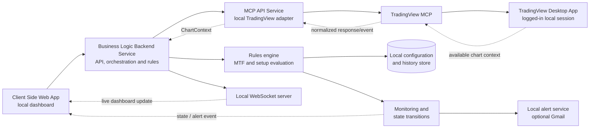

# High-level design

## System boundary

The system runs only on the user's Mac or Windows machine. Its primary request path deliberately follows the supplied `high-level-design-flow.png`:

```text
Client Side Web App → Business Logic Backend Service → MCP API Service
→ TradingView MCP → TradingView Desktop App
```

TradingView Desktop remains the source of available chart context. The local backend owns rule evaluation and supplies WebSocket updates to the local browser dashboard.



## Request path versus update path

| Path | Direction | Meaning |
| --- | --- | --- |
| Command/request path | Dashboard → Backend → MCP API service → TradingView MCP → TradingView Desktop | Requests chart context, refreshes, or other supported local TradingView actions. |
| Chart-context update path | TradingView Desktop → TradingView MCP → MCP API service → Backend | Returns only the context supported by the MCP integration. |
| Dashboard live-update path | Backend → local WebSocket → Dashboard | Streams evaluated setup state, health, and notification events to the browser. |

The dashboard WebSocket is therefore a **local backend-to-dashboard connection**. It is not described as a direct unsupported connection to TradingView's internal chart WebSocket.

## Component responsibilities

| Component | Responsibility | Must not do |
| --- | --- | --- |
| Client Side Web App | Present current state, evidence, health, and manual decisions | Calculate hidden trade logic or place orders |
| Business Logic Backend Service | Coordinate requests, configuration, rule evaluation, local APIs, and WebSocket events | Depend on a public cloud service |
| MCP API Service | Translate available TradingView MCP responses into a stable internal chart-context model | Pretend unavailable data is current |
| Rules engine | Evaluate deterministic MTF and setup rules | Fetch data or manage UI concerns |
| Monitor | Detect state changes, debounce alerts, keep audit history | Repeat identical notifications continuously |
| Local store | Persist configurations, rule versions, history, and manual decisions | Store TradingView passwords or secrets in source control |

## Architecture constraints

- Bind browser-facing services to `localhost` by default.
- Treat the MCP integration as a capability that must be validated by an early technical spike.
- Keep TradingView-specific details inside the adapter so the rules engine can be tested with recorded contexts.
- Do not use direct undocumented TradingView chart WebSocket protocols as a product dependency.
