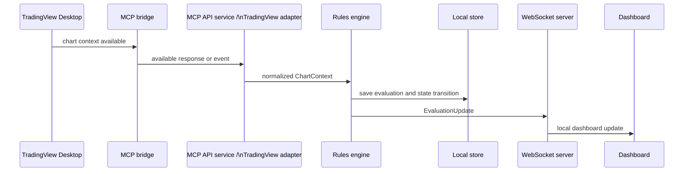

# Low-level design

## Internal flow

## Core domain objects

| Object | Key fields |
| --- | --- |
| `ChartContext` | symbol, exchange, timeframe, timestamp, OHLCV, indicator values, source ID, source status |
| `RuleResult` | rule ID, outcome, reason, evidence, mandatory flag, weight, evaluated timestamp |
| `SetupEvaluation` | setup ID/version, symbol, timeframe inputs, score, status, rule results, invalidation state |
| `SetupStateTransition` | previous status, new status, reason, timestamp, notification eligibility |
| `ConnectionHealth` | component, state, last-success timestamp, detail, recovery timestamp |

## Status model

`Data unavailable → Not ready → Developing → Near ready → Confirmed → Invalidated`

Status is not determined from percentage alone. A setup can be `Invalidated` even if many optional rules pass. Mandatory rule failure or missing critical context blocks `Confirmed`.

## Interface contracts

- The adapter produces normalized `ChartContext` objects; no other layer parses raw MCP data.
- The adapter attempts the official MCP first. It may use the Desktop bridge only after a documented fallback decision; every response identifies its source.
- The official MCP supplies OHLCV and single-timeframe technical snapshots. Multi-timeframe combination and historical indicator calculations occur in the local rules engine; see [capability matrix](tradingview-mcp-capability-matrix.md).
- The official-MCP client uses application-owned OAuth 2.1 with PKCE, a localhost callback, and operating-system keyring storage. It never reads Codex OAuth credentials.
- The rules engine is a pure calculation boundary: the same context must yield the same evaluation.
- The WebSocket sends versioned, structured events rather than presentation-only text.
- The dashboard renders the supplied evaluation and must show the source timestamp and stale/unavailable state.
